## 3. Make updates
Then, make the updates to the `README.md` file and add any other files necessary. `README.md` files are written in GitHub-flavored markdown, see [here](https://github.com/adam-p/markdown-here/wiki/Markdown-Cheatsheet) for a quick reference. 


## 4. Push to GitHub
Periodically, you will want to do a `git commit` to stash the changes locally. Then, when you are ready or need to step away, do a `git push origin master` to push the local changes to github.com. 

## 5. Request to add to xM Labs
Once you are all finished, let Travis know and he will then fork it to the xMatters account and update the necessary links in the xM Labs main page. From there if you update your repo, those changes can be merged into the xMatters account repo and everything will be kept up to date!

# Template below:
---

# Cherwell On-Premise xMatters Integration
Cherwell is a leading ITSM tool capable of advanced incident management. The interface provides a framework for building complex workflow with simple point and click - no coding! - widgets. When coupled with xMatters, this integration:

* Can notify the Owned By Team or the Owned By User about details of an incident.
* Can update the Status and Owned By of the incident when a user responds to a notification.
* Can add Journal Entries to the Incident Record detailing what xMatters is doing.
* Can terminate the xMatters event when it is resolved in Cherwell.
* Once an event is sent to xMatters Integraiton Agent a Cherwell REST API Get Incident and Get Task call allows for passing any incident or task field to xMatters. Included Communication Plan will need to be modified to accomodate any additional fields passed to xMatters.
* A Cherwell webservice Onestep object or and Email can be used to trigger the xMatters event.
* Parse Email Outbound Integration script included to break up email body for email initiated events.
<br><br>
The Cherwell (On-Premise) communication plan contains the following __inbound__ integrations:

* __New Incident One Step__: This integration receives the HTTP POST from Integration Agent and builds the event payload. It will query to make sure the targeted recipient exists and, if not, will set the recipient to null, forcing the event to target the recipient in the New Incident form. 
* __Terminate Events__: This integration parses the Incident ID and queries for all * active events in xMatters with that Incident ID and then terminates them. 
<br><br>
The communication plan also contains the following __outbound__ integrations:

* __Event Delevery Notifications (IA)__: Updates the Incident Journal with devlivery information. This has been tested to work but has not been tested extensively.
* __Event Status Notifications (IA)__: Updates the Incident Journal with event status information.
* __Response Notifications (IA)__: Updates the Incident Journal with responses from users and updates the Task Status and Owned By fields if the response is "Assign to me".


<kbd>
  
</kbd>

# Pre-Requisites
* Virtual Machine running the newest version of the xMatters Integration Agent 
* Cherwell On-Premise v8 +
* xMatters account - If you don't have one, [get one](https://www.xmatters.com)!

# Files
* [CherwellOnPremise.zip](CherwellOnPremise.zip) - This the Cherwell On-Premise Communication plan.
* [Cherwell_IS_Package.zip](Cherwell_IS_Package.zip) - This the xMatters Integration Service for use with the Integration Agent.

# How it works
Out of the box, the integration uses a One Step to initiate a webservice call with the record id's from Cherwell Incident and Task records to the xMatters Integration Agent. The web service makes an HTTP POST to the Integration Agent, which generates the event payload and passes it to xMatters inbound integration. The Integration Agent uses Cherwell REST API to GET Incident and Task properties from Cherwell. This is used to avoid known bugs in cherwell webservice OneStep when fields contains certain special characters. After retreiving Cherwell property values, the New Incident One Stop inbound integration is targeted from the Integration Agent.  An Automation Process is used to kick off the Cherwell One Step automatically when specified criteria are met. This cam be customized to whatever criteria you see fit. This integration was designed for Automation Processes that kickoff for all Tasks related to Priority 1 and 2 Indicents.

Before creating the event, the integration builder script will check the Assigned Group set in Cherwell is not empty. If the Assigned Group is empty, xMatters will target a hard coded group defaulted to Service Desk. This group can be changed as required.

This integration will initiate an xMatters Notification when an incident __Task Record__ is created. It will update assigned user to the Incident Task, not the Incident Record.


# Installation
Details of the installation go here. 
<br><br>

## xMatters set up
The first step in setting up your integration is to configure xMatters On-Demand.
<br><br>

### Create an integration user
This integration requires a user who can authenticate REST web service calls when injecting events.

This user needs to be able to work with events, but does not need to update administrative settings. While you can use the default Company Supervisor role to authenticate REST web service calls, the best method is to create a user specifically for this integration with the "REST Web Service User" role that includes the permissions and capabilities.

__Note__: If you are installing this integration into an xMatters trial instance, you don't need to create a new user. Instead, locate the "Integration User" sample user that was automatically configured with the REST Web Service User role when your instance was created and assign them a new password. You can then skip ahead to the next section.

__To create an integration user:__

1. Log in to the target xMatters system.
2. On the __Users__ tab, click the __Add New User__ icon.
3. Enter the appropriate information for your new user. 
    Example User Name __cherwell_API_User__
4. Assign the user to the __REST Web Service User__ role.
5. Click __Save__.
6. On the next page, set the web login ID and password. 

Make a note of these details; you will need them when configuring other parts of this integration.

This users details will be user for constants in the Integration Services Configuration Script: 
__INITIATOR__ and __PASSWORD__


<br><br><br>
### Create users and groups that will receive notifications

The integration will notify the group or user defined as the "Owned By Team". If this recipient doesn't exist in xMatters, a hard coded group (Defaulted to "Service Desk") inside of the inbound integration New Incident One Step. This group can be changed as required.

You can change this on lines 35 to 41 of Inbound Integration New Incident One Step.

__DEVELOPER tab -> Cherwell (On-Premise)__ communication plan -> __Edit Integration Builder -> Inbound Integrations -> New Incident One Step__

*This integration does not synchronize users and groups. Make sure you have created your users and groups in xMatters before using this integration.*

For more information about creating users and devices in xMatters, refer to the [xMatters On-Demand help](https://help.xmatters.com/ondemand/xmatters.htm).


<br><br><br>
### Import the xMatters Communication Plan

The next step is to import the communication plan.

To import the communication plan:

1. In the target xMatters system, on the __Developer__ tab, click __Import Plan__.
2. Click __Browse__, and then locate the downloaded communication plan: [CherwellOnPremise.zip](CherwellOnPremise.zip)
3. Click __Import Plan__.
4. Once the communication plan has been imported, click __Plan Disabled__ to enable the plan.
5. In the __Edit__ drop-down list, select __Forms__.
6. For the __New Incident__ form, in the __Not Deployed__ drop-down list, click Create __Event Web Service__.
7. After you create the web service, the drop-down list label will change to __Web Service Only__.
8. In the __Web Service Only__ drop-down list, click __Permissions__.
9. Enter the REST API user you created above, and then click __Save Changes__.


<br><br><br>
### Accessing web service URLs

Each integration service has its own URL that you can use to target it from Cherwell.

__To get a web service URL for an integration service:__

1. On the Integration Builder tab, expand the list of inbound integrations.
2. Click the gear icon beside the integration service you want to target, and then select __Integration URL__.
3. If Authentication is required, click the Lock icon and note the username and password credentials. They will be needed later. 

<kbd>
  
</kbd>
<br><br>
You will need the URL for each integration service when configuring Cherwell.


<br><br><br>
### Create Integration Services

This integration uses an integration services that need to be created on the "applications" event domain.

__To create the integration services:__

1. In xMatters, on the Developer tab, click Event __Domains__.
2. In the Event Domains list, click the __applications__ link.
3. On the Event Domain Details page, in the Integration Services section, click the __Add New__ link.
4. On the Integration Service Details page, in the __Name__ field, type "__cherwell__" and then click __Save__.
5. Click the __Add New__ link again.


<br><br><br>
## Configure the xMatters Integration Agent

Now that you've configured xMatters On-Demand, it's time to configure the integration agent

The installation instructions below assume you already have a working xMatters integration agent.  If this is a new installation and you have not yet deployed the integration agent please follow this link to download, deploy, and configure:

[Integration Agent for xMatters 5.x & xMatters On-Demand](https://support.xmatters.com/hc/en-us/articles/202370225)


<br><br><br>
### Install the Integration Service package

The Cherwell Integration Service package contains all that you need to configure the Cherwell On-Premise integration to work with the integration agent.

__To install the package:__

1. Extract Cherwell Integration Service Package [Cherwell_IS_Package.zip](Cherwell_IS_Package.zip) to get a folder named integrationservices. 

2. Copy the __integrationservices__ folder to the installation directory of the integration agent: for example: C:\xMatters\integrationagent-5.1.5
   * This folder is referred to as ```<IAHOME>``` in the remainder of the instructions.

3. Open the __<IAHOME>/conf/IAConfig.xml__ file and add the following line to the "__service-configs__" section (Around line 330):
 
 ```
<path>/applications/cherwell/cherwell.xml</path>
 ```

4. __Save__ and close the file.


<br><br><br>
## Configure Cherwell
Now that you've configured xMatters, you can configure Cherwell to integrate with xMatters. The following sections require you to log into Cherwell and access the Configuration page.

<br><br>
### Create xMatters User in Cherwell

Navigate to the CSM Administrator > Security menu and click Edit Users. Create a new user and note the Login ID and Password. Set the Security Group as "IT Service Desk Manager" to enable updating of Incident records. You can set the Security Group differently as long as the group has access to update appropriate tables.

<br>
<kbd>
  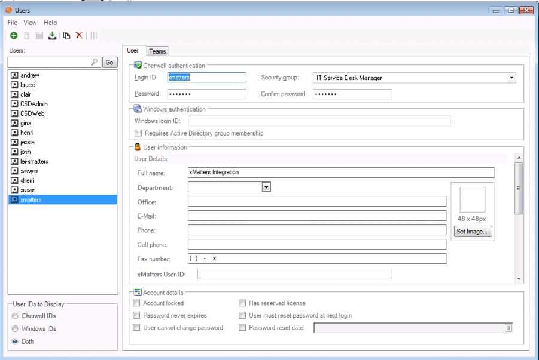
</kbd>


<br><br><br>
## Set up Cherwell API Client Key

1. Go to CSM Administrator > Security menu, click Edit REST API client settings.

2. Click the Green Plus Icon.

3. Provide the following settings:

    
    * __Name__: xMatters
    * __Culture__: Default / English
    * __Token Lifespan__: 20 minutes
    * __Refresh Token Lifespan__: 1440 minutes
    * __API Access is Enabled__: True
    * __Allow Anonymous Access__: False
    

<br>
<kbd>
  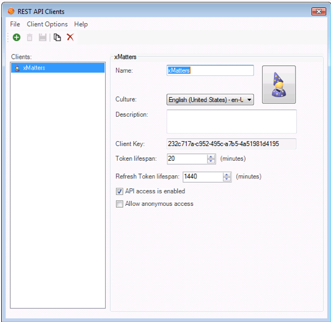
</kbd>
<br><br>

4. Take note of the Client Key you will need this when configuring the Integration Service Configuration.js file.


<br><br><br>
## Create Web Service to Trigger xMatters Integration Agent

1. Open the Web Service Manager.
     * From the CSM Administrator Main window, click the __Browser and Mobile__ category, and then click the __Web Service Manager__ task.
     * From within a One-Step (create a One-Step > add a Call a Web Service One-Step Action), click the __Ellipses__ button <kbd></kbd>.


2. Select a __scope__ and subfolder (if needed) for the Web service.

3. Click the __Create New__ button Create New Button.

The Web Service Options window opens, displaying two pages (General and Methods; Accounts appears later if you select to use Basic Security).


<br>
<kbd>
  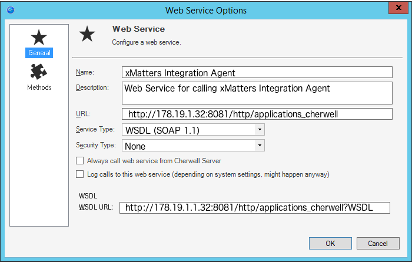
</kbd>

4. Click the General page.

5. Define general properties for the web service:

      
      * __Name__: xMatters Integration Agent
      * __Description__: Web Service for calling xMatters Integration Agent
      * __Service Type__: WSDL (SOAP 1.1)
      * __Security Type__: None 
      * __WSDL URL__: This will automatically populate
      

__URL__: http://__Integration_Agent_URL__/http/applications_cherwell

  * _URL should start with http://_
  * _The Integration_Agent_URL should contain an ip address and a port number._
     _Example: 178.19.1.32:8081_
  * Integration_Agent_URL should include __/http/applications_cherwell__ at the end

__Complete Web Service URL Should look as follows:__
http://178.19.1.32:8081/http/applications_cherwell
<br><br>
__The Integration Agent URL can be found by:__

      1. Go to DEVELOPER tab.
      2. Click Agents.
      3. Click INSTALLED tab.
      4. Click Show Details.

<br>
<kbd>
  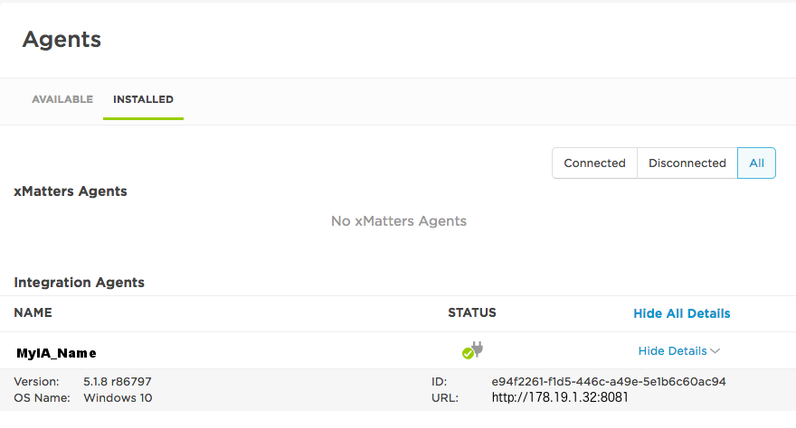
</kbd>
<br><br>

6. Click the Methods page.

<br>
<kbd>
  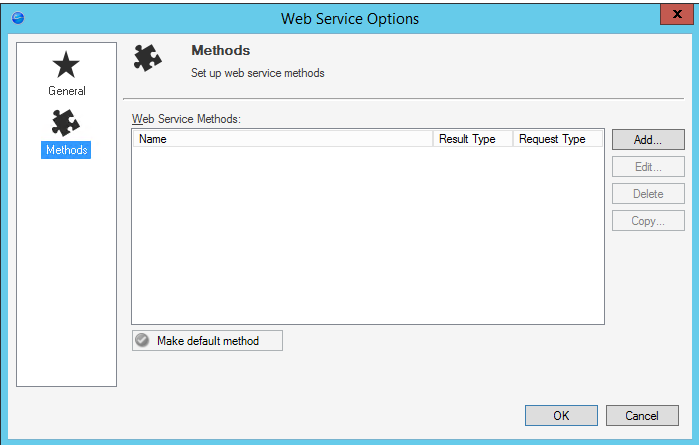
</kbd>
<br>

7. Define a Web Service Method:

   1. Click the Add... button to add a Method.

   2. Define properties for the Methods:

      
      * __Name:__ IntegrationServiceRequest
      * __Result Type__: None
      * __Request Type__: POST
      
<br>
<kbd>
  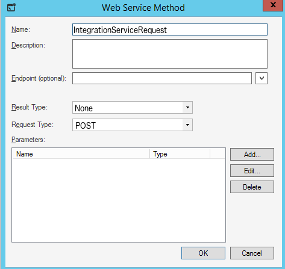
</kbd>
<br>

   3. Add a new Parameter to the Web Service Method by clicking:

      1. Click Add...

      2. Define properties for the Web Service Parameter:

        
          * __Name__: IntegrationServiceRequest
          * __Data Type__: Text
          * __Parm Type__: Standard
        
<br>
<kbd>
  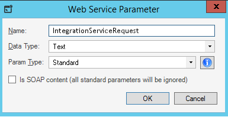
</kbd>
<br><br>

      3. Click OK


   4. Completed Web Service Method Should look as follows:

<br>
<kbd>
  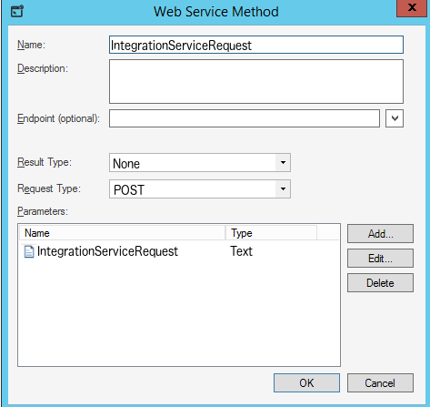
</kbd>
<br><bR>


   5. Click OK.
      This will close the Web Service Method dialogue.


8. Completed Methods should look as follows:

<br>
<kbd>
  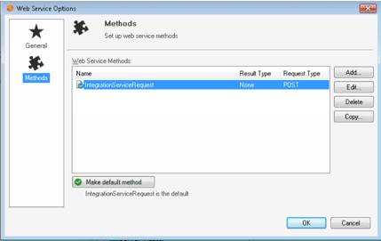
</kbd>
<br><br>


9. Click OK.
   This will save a new Web Service Option with the name xMatters Integration Agent.

<br><br><br>
### Create a new Cherwell One-Step

1. Open the One-Step Manager:
    
      From the __CSM Desktop Client menu bar__, click __One-Step > One-Step Manager__.
      <br>
      <kbd>
        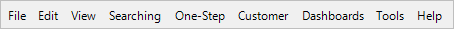
      </kbd>
      <br><bR>

      From the __Browser Client menu bar__, click __One-Step > One-Step Manager__.
      <br>
      <kbd>
        
      </kbd>
      <br><bR>

      From the __Blueprint Editor menu bar___ in CSM Administrator, click __Managers > One-Step__.
      <br>
      <kbd>
        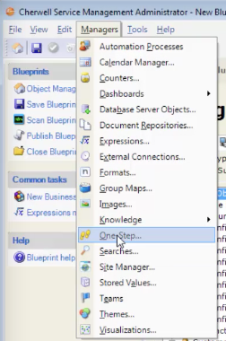
      </kbd>
      <br><bR>

2. Select __Global__ scope.

3. Select a Business Object Association: __Incident__

      <kbd>
        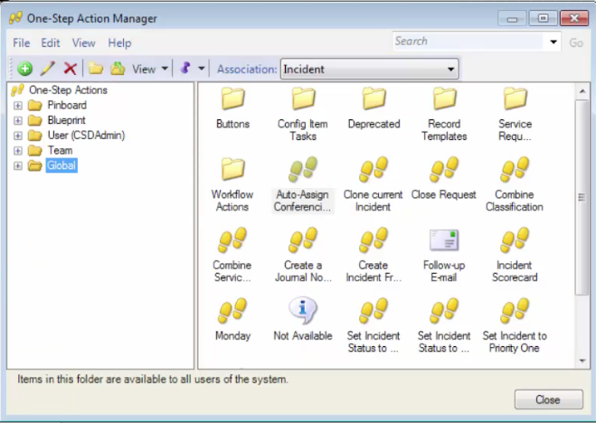
      </kbd>
      <br><bR>

4. Click the __Create New__ button Create <kbd> </kbd>.


5. Provide a __Name__ and __Description__ for the One-Step.

    * __Name__: xMatters Integration Agent
    * __Description__: Trigger xMatters Integration Agent Web Service

        <kbd>
          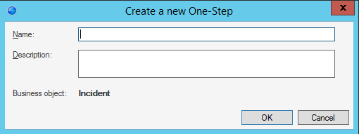
        </kbd>
        <br><bR>

6. Click __OK__.

      The One-Step Editor opens.


7. Define Conditions for when you want this one step to run. 

      _It is recommended to leave these settings along as an Automation Blueprint will be used to trigger the one-step._
      <br>
      <kbd>
        
      </kbd>
      <br><bR>

8. Add a __Call a Web Service Action__ to the Designer Board.

      Advanced Actions -> Call a Web Service
      <br>
      <kbd>
        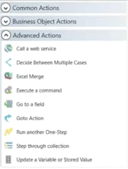
      </kbd>
      <br><bR>
      __The One Step should look as follows:__
      <br>
      <kbd>
        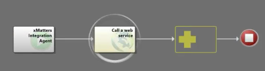
      </kbd>
      <br><bR>

9. __Select__ the Call a Web Service Action.

10. Click __General__ page.

11. __Define__ the __General__ properties for the Call a Web Service Action.

    * __Name__: Call a xMatters Web Service
    * __Service__:  Click the __Ellipses__ button <kbd></kbd> then select the __xMatters Integration Agent__ Web Service we created earlier.
        See: [Create Web Service to Trigger xMatters](https://github.com/m3steele/xm-labs-Cherwell-On-Premise-xMatters#create-web-service-to-trigger-xmatters-integration-agent)
        <br>
        <kbd>
          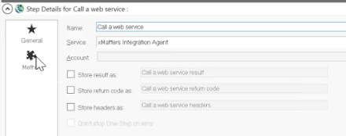
        </kbd>
        <br><bR>

12. Click the __Method__ Page.

13. __Specify__ the Method to call on the web service:

    * In the Method drop-down, select __IntegrationServiceRequest__.
      * _The Parameters tree will show all the parameters for the selected method_.

14. __Select__ IntegrationServiceRequest in the Parameter tree.

15. __Define__ the IntegrationServiceRequest Method Parameter:

    1. Select __Set Value__.

    2. Specify the following Value:

      ```
      <Incident_Rec_ID>Incident.RecID</Incident_Rec_ID>
      <Incident_ID>Incident.Incident ID</Incident_ID>
      <Task_Rec_ID>Task.RecID</Task_Rec_ID>
      <Task_Rec_ID>Task.Task ID</Task_Rec_ID>
      ```

      __Important Note__: 
      * The values inside of ```<>``` MUST REMAIN exactly as they are above. These are referenced in the integration service script
      * If these values are modified, the Integration Agent Script will need to be modified.
      * You will need to insert the Cherwell Reference Tokens (```<>Reference.Token</>```) yourself. Copy and pasting the value from above to Cherwell will not work.
        * You can insert a Cherwell Reference Token with the __Selector__ button <kbd></kbd>.

    3. Click __Save__ <kbd></kbd> Button (Top Left corner).


16. Click __OK__ (Bottom Right corner).

   The One-Step will be Save and return you to the One-Step manager where you will see the new One-Step.


<br><br><br>
## Create an Automation Process for __Initiating__ and __Terminating__ xMatters events. 

You will need to follow this process TWICE. Once for __Initiating__ and once for __Terminating__ xMatters events.

1. From the __CSM Administrator__ main window, click the __Automation Process__ category and then click __Create a New Automation Process Blueprint__.

2. Click the __New__ button <kbd></kbd> and select __Simple Action/Event Process__.

    The Simple/Event Process window opens.

    <br>
    <kbd>
      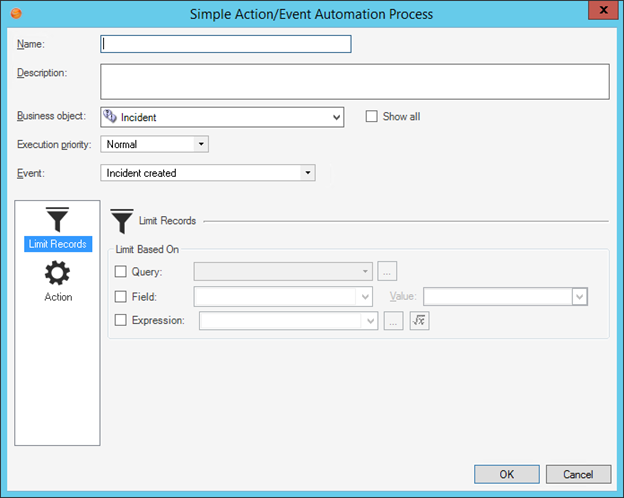
    </kbd>
    <br><bR>

3. Define __General__ Properties:

    __Initiating xMatters Events__

    * __Name__: xMatters Notify Team on Incident
    * __Description__: Initiate xMatters Integration Agent One-Step to notify with xMatters.
    * __Business Object__: Task
    * __Execution Priority__: Normal / Your preference
    * __Event__: Task Created

    __Terminating xMatters Events__

    * __Name__: xMatters Task Resolver Found
    * __Description__: Intiate xMatters Integration Agent One-Step to terminate xMatters event.
    * __Business Object:__ Task
    * __Execution Priority__: Normal / Your preference
    * __Event__: Task Status Changed / Task User Assigned


This step will define when the Onestep which sends a webhook to the xMatters Integration should takes place. 
You can set the values of these based on your specific requirements. 

If you do not use Tasks as part of your incident notification process, you can modify the Automation Process to trigger off Incidents or whatever you desire.

Keep in mind, changes may be required in the Integration Services Script if you change this from a Task trigger.


4. Define __Limit Records__ section.

    Limit when the xMatters integration is triggered. 

    For further information on how to limit records that trigger automation process see Cherwell Documentation [here](https://cherwellsupport.com/webhelp/en/8.0/22026.htm).

5. Click __Action page__.
    <br>
    <kbd>
      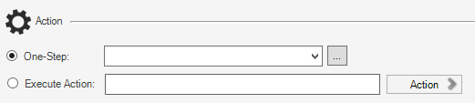
    </kbd>
    <br><bR>

6. __Define__ a __One-Step__ to run when the event takes place:

    1. Select the One-Step radio button.
      The One-Step Field and Ellipses button become active.

    2. Click the __Ellipses__ button <kbd></kbd> to open the One-Step Manager, and then select xMatters Integration Agent One-Step created previously. 
    See: [Create a new Cherwell One-Step](https://github.com/m3steele/xm-labs-Cherwell-On-Premise-xMatters#create-a-new-cherwell-one-step)

7. Click __OK__.
    

<br><br><br>
## Configure the Integration Service Package

Open the __configuration.js__ file found in the

```<IAHOME>\integrationservices\applications\cherwell``` folder and set the values for the following variables:


| Configuration Variable | Description |
| ------------------------------- |:-----------------------------------------------------------------------------------------------------:|
| WEB_SERVICE_URL                 | The Web Service URL of the "New Incident One Step" xMatters inbound integration (see [Accessing web service URLs](https://github.com/m3steele/xm-labs-Cherwell-On-Premise-xMatters#accessing-web-service-urls), above)|
| XMATTERS_ONDEMAND               | The base URL of your xMatters instance. Do NOT include trailing slash. Example: https://company.xmatters.com |
| WEB_SERVICE_TERMINATE_URL       | The Web Service URL of the "Terminate Events" xMatters inbound integration (see [Accessing web service URLs](https://github.com/m3steele/xm-labs-Cherwell-On-Premise-xMatters#accessing-web-service-urls), above)      |
|                                 |       |
| __Cherwell Parameters__         |       |
| ------------------------------- |:-----:|
| The values in the _configureation.js_ file are most likely already correct. It is advised however to double check these values. |
|                                 |       |
| CHERWELL_JOURNAL_TYPEID         | Replace with Your Cherwell Journal TypeID if it is different           |
| CHERWELL_JOURNAL_TYPENAME       | Replace with Cherwell Journal Type Name if it is different             |
| CHERWELL_INCIDENT_OBJID         | Replace with Cherwell Incident Business Object ID if it is different   |
| CHERWELL_TASK_OBJID             | Replace with Cherwell Task Business Object ID if it is different       |
| CHERWELL_SERVER                 | The base URL of your Cherwell On-Premise Server. Do not inlude trailing slashes.                                |
|                                 |       |
| __Webservice Parameters__       |       |
| ------------------------------- |:-----:|
| INITIATOR                       | The User ID of the REST API user you created in xMatters. (see [Create an Integration User](https://github.com/m3steele/xm-labs-Cherwell-On-Premise-xMatters#create-an-integration-user), above).      |
| PASSWORD                        | Path and filename of the password file containing the encrypted REST API user's password. <br><br> For more information about creating this file, refer to the [xMatters integration agent guide](https://support.xmatters.com/hc/en-us/articles/202004275).<br><br> The password is what was set in [Create an Integration User](https://github.com/m3steele/xm-labs-Cherwell-On-Premise-xMatters#create-an-integration-user), above.     |
| CHERWELL_WS_ID                  | The Cherwell API Client Key (see [Set up Cherwell API Client Key](https://github.com/m3steele/xm-labs-Cherwell-On-Premise-xMatters#set-up-cherwell-api-client-key), above).      |
| CHERWELL_WS_USER                | The Cherwell User Name created so xMatters can authenticate into Cherwell (see [Create xMatters User in Cherwell](https://github.com/m3steele/xm-labs-Cherwell-On-Premise-xMatters#create-xmatters-user-in-cherwell), above).      |
| CHERWELL_WS_PASSWORD            | The Cherwell User Password created so xMatters can authenticate into Cherwell (see [Create xMatters User in Cherwell](https://github.com/m3steele/xm-labs-Cherwell-On-Premise-xMatters#create-xmatters-user-in-cherwell), above).      |


<br><br><br><br><br><br><br><br><br><br><br>


      IncidentRecord = getIncidentRecord (event.properties['Incident ID']);

 IALOG.info("IncidentRecord Returned: " + JSON.stringify(IncidentRecord));

	event.properties['Short Description'] = IncidentRecord.fields[182].value;
	event.properties.Description = IncidentRecord.fields[12].value;
	event.properties.Category =  IncidentRecord.fields[9].value;
   	event.properties.Subcategory = IncidentRecord.fields[10].value;
   	event.properties.Priority = IncidentRecord.fields[15].value;
	event.properties.Service = IncidentRecord.fields[8].value;
	event.properties['IT Performance Issue'] = IncidentRecord.fields[221].value;
	event.properties['Major Incident'] = IncidentRecord.fields[167].value;


// ***
// B. Get Task
// ***

TastRecord = getTaskRecord (event.properties['Task ID']);


IALOG.info("TaskRecord Returned: " + JSON.stringify(TastRecord));

	event.properties['Assigned Group'] = TastRecord.fields[8].value;
	event.properties.Status = TastRecord.fields[60].value;
	

      <short_description>Incident.Short Description</short_description>
      <description>Incident.Description</description>
      <service>Incident.Service</service>
      <category>Incident.Category</category>
      <subcategory>Incident.Subcategory</subcategory>
      <priority>Incident.Priority</priority>
      <owned_by>Incident.Owned By</owned_by>
      <assigned_group>Incident.Owned By Team</assigned_group><status>Incident.Status</status>


2. Add this code to some place on what page:
   ```
   var items = [];
   items.push( { "stuff": "value"} );
   console.log( 'Do stuff' );
   ```


## Application ABC set up
Any specific steps for setting up the target application? The more precise you can be, the better!

Images are encouraged. Adding them is as easy as:
```
<kbd>
  
</kbd>
```

<kbd>
  
</kbd>


# Testing
Be specific. What should happen to make sure this code works? What would a user expect to see? 

# Troubleshooting
Optional section for how to troubleshoot. Especially anything in the source application that an xMatters developer might not know about, or specific areas in xMatters to look for details - like the Activity Stream? 
